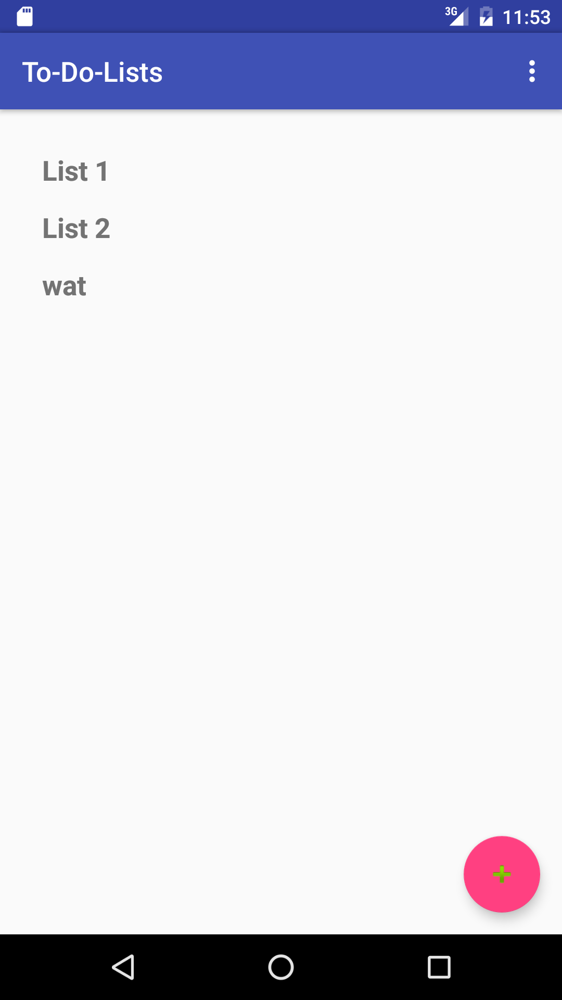

# To-Do-Lists
Project 1

(HERE'S A LINK TO A NEW REPO THAT I'D SET UP FOR THE PROJECT, WHICH HAS ALL MY COMMITS:

https://github.com/davidhstone/To-Do-Lists

 - the instructions specified to make a new repo, rather than to fork and clone, so I added all my commits to the repo linked above. my foorked repo contains the contents of that repo, copied and pasted into my clone of the instructors' repo for the project)

OK, this app adds to do lists to a list of to-do lists with a button
clicking on a new list will bring you to a second screen in which 
you can add items/descriptions to a to-do list.

there's also a checkbox nect to each item so you can mark the item completed.

I intend on adding remove functinoality so you can remove the to-do lists,
and remove items in individual to-do lists.

I also want to add the code so it remembers if an item was checked as completed.

as far as its current functionality goes, I don't see any obvious bugs.

